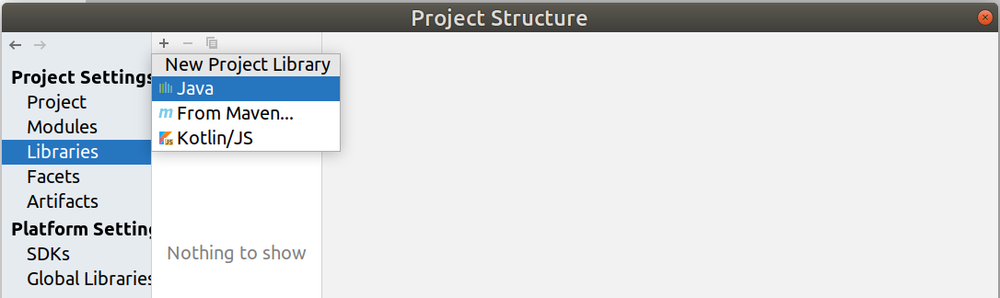
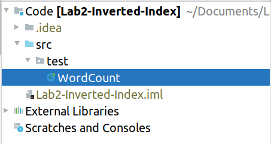

# IDEA & Hadoop配置方法

```wiki
参考如下的教程，应该可以完成所有的配置。
-----------------------------------------------
注意！
所有配置均在./Code/文件夹下进行，请勿污染根目录。
```


## 建立项目

1. 打开IntelliJ IDEA -> Create New Project，选择Java，注意`jdk版本为1.8`。

2. File -> Project Structure -> Libraries -> + -> Java，添加Hadoop的依赖。

   

   均位于${HADOOP_HOME}/share/hadoop/下，需要：

   - common
   - common/lib
   - mapreduce
   - mapreduce/lib
   - yarn


## 代码规划

1. 在`./src/[part]/`下编写相应的代码。

   其中，`[part]`为对应的部分，比如这里建立`./src/test/`用来存储测试类`WordCount`。

   

   *其中是Hadoop给出的官方WordCount代码。*

2. 此时文件的静态分析应该不报错，说明所有的包均引入成功。


## 生成JAR包

